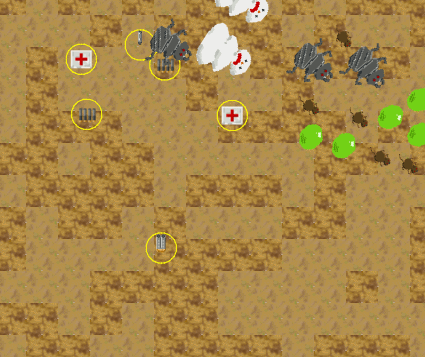

Ludum Dare 31: One Screen
=========================

For Ludum Dare 31:  Theme is "Entire Game on One Screen"

It is a simple arena battle game, with waves and waves of monsters, weapon and pickups.

My first HTML 5 game attempt, I learned quite a lot.  Regrettably ran out of time.. Was planning more monsters, better AI, monster projectiles, more weapons/upgrades. 

Play
====
To play, click here:  http://lasty.github.io/ld31_onescreen

Here is an animated .gif screenshot:

